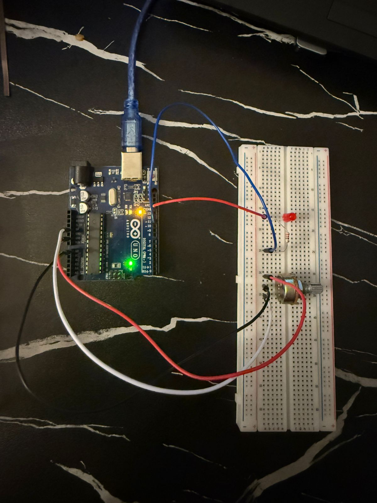

# 💡 Arduino LED Dimmer (Potentiometer)

## 📌 Overview

This project controls the brightness of an LED using a potentiometer.

It’s a simple project, but it helped me understand how analog input works and how it can be used to control output in real time.

## 🎥 Demo

## 📸 Setup

## 🧰 Components Used

* Arduino board
* LED
* Resistor
* Potentiometer
* Breadboard
* Jumper wires

## ⚡ How It Works

The potentiometer acts like a variable resistor.

* Turning the knob changes the voltage at the middle pin
* Arduino reads this using `analogRead()` (0–1023)
* That value is scaled and used to control LED brightness using `analogWrite()` (0–255)

## 🧠 What I Learned

* How a potentiometer works (3 pins: 5V, GND, signal)
* How analog input is read using Arduino
* Difference between `analogRead` and `analogWrite`
* How to control brightness using PWM

## 🚧 Challenges Faced

At first, the LED was not behaving correctly because I didn’t understand how the potentiometer wiring worked.

Once I fixed the wiring and understood how the values scale, everything worked properly.

## 🎉 Final Thoughts

This was a simple but important project. It helped me understand how input devices like potentiometers can control outputs like LEDs.

## 📂 Code

See `led_dimmer.ino`
